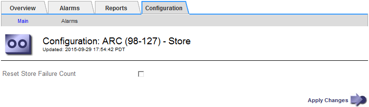

= Zurücksetzen der Speicherfehler-Anzahl für S3-API-Verbindung
:allow-uri-read: 
:icons: font
:imagesdir: ../media/

[role="lead"]
Wenn Ihr Archiv-Node über die S3-API eine Verbindung zu einem Archivspeichersystem herstellt, können Sie die Anzahl der Speicherfehler zurücksetzen, die zum Löschen des ARVF-Alarms (Store Failures) verwendet werden kann.

.Bevor Sie beginnen
* Sie sind mit einem bei Grid Manager angemeldet link:../admin/web-browser-requirements.html["Unterstützter Webbrowser"].
* Das ist schon link:admin-group-permissions.html["Bestimmte Zugriffsberechtigungen"].

.Schritte
. Wählen Sie *SUPPORT* > *Tools* > *Grid-Topologie* aus.
. Wählen Sie *_Archivknoten_* > *ARC* > *Store* aus.
. Wählen Sie *Konfiguration* > *Main*.
+

. Wählen Sie *Anzahl Der Fehler Im Store Zurücksetzen* Aus.
. Wählen Sie *Änderungen Anwenden*.
+
Das Attribut Fehler speichern wird auf Null zurückgesetzt.

