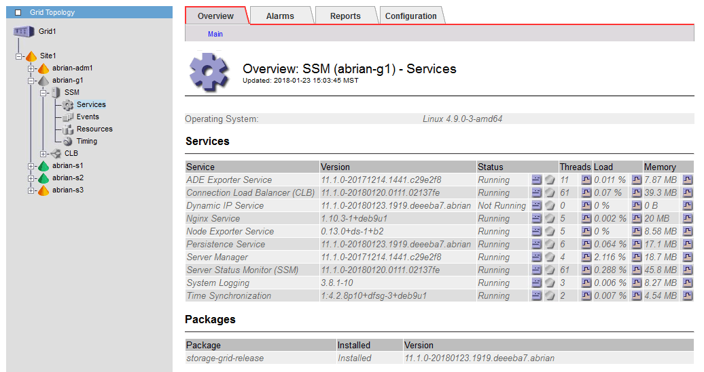

= Stellt die Netzwerkverbindung für isolierte Knoten wieder her
:allow-uri-read: 
:icons: font
:imagesdir: ../media/

[role="lead"]
Unter bestimmten Umständen, z. B. Änderungen an der IP-Adresse für Standort oder das gesamte Grid, kann sich eine oder mehrere Node-Gruppen möglicherweise nicht an den Rest des Grid wenden.

.Über diese Aufgabe
Wenn im Grid Manager (*SUPPORT* > *Tools* > *Grid Topology*) ein Knoten grau ist oder wenn ein Knoten blau ist und viele seiner Dienste einen anderen Status als ausgeführt aufweisen, sollten Sie nach einer Knotenisolierung suchen.

Isolierte Nodes haben einige der Folgen:

* Wenn mehrere Knoten isoliert sind, können Sie sich möglicherweise nicht bei Grid Manager anmelden oder auf diesen zugreifen.
* Wenn mehrere Nodes isoliert sind, sind möglicherweise die im Dashboard für den Mandanten-Manager angezeigten Werte für Speichernutzung und Kontingent nicht mehr aktuell. Die Gesamtwerte werden aktualisiert, wenn die Netzwerkverbindung wiederhergestellt ist.

Um das Isolationsproblem zu lösen, führen Sie auf jedem isolierten Knoten oder auf einem Knoten in einer Gruppe (alle Knoten in einem Subnetz, das nicht den primären Admin-Node enthält) ein Befehlszeilen-Dienstprogramm aus, das vom Raster isoliert ist. Das Dienstprogramm stellt den Knoten die IP-Adresse eines nicht isolierten Knotens im Raster zur Verfügung, sodass der isolierte Knoten oder die Gruppe der Knoten das gesamte Raster erneut kontaktieren kann.

NOTE: Wenn das Multicast-Domänennamensystem (mDNS) in den Netzwerken deaktiviert ist, muss das Befehlszeilendienstprogramm möglicherweise auf jedem isolierten Knoten ausgeführt werden.

.Schritte
. Auf den Knoten zugreifen und überprüfen `/var/local/log/dynip.log` Für Isolationsmeldungen.
+
Beispiel:

+
[listing]
----
[2018-01-09T19:11:00.545] UpdateQueue - WARNING -- Possible isolation, no contact with other nodes.
If this warning persists, manual action might be required.
----
+
Wenn Sie die VMware Konsole verwenden, enthält sie eine Meldung, dass der Node möglicherweise isoliert ist.

+
Bei Linux-Bereitstellungen werden in Isolationsmeldungen angezeigt `/var/log/storagegrid/node/<nodename>.log` Dateien:

. Wenn die Isolationsmeldungen immer wieder und dauerhaft sind, führen Sie den folgenden Befehl aus:
+
`add_node_ip.py <address>`

+
Wo `<address>` Ist die IP-Adresse eines Remote-Node, der mit dem Grid verbunden ist.

+
[listing]
----
# /usr/sbin/add_node_ip.py  10.224.4.210

Retrieving local host information
Validating remote node at address 10.224.4.210
Sending node IP hint for 10.224.4.210 to local node
Local node found on remote node. Update complete.
----
. Überprüfen Sie Folgendes für jeden zuvor isolierten Node:
+
** Die Services des Knotens wurden gestartet.
** Der Status des Dynamic IP-Dienstes lautet „Running“, nachdem Sie den ausgeführt haben `storagegrid-status` Befehl.
** In der Struktur Grid Topology erscheint der Knoten nicht mehr vom Rest des Rasters getrennt.

NOTE: Wenn Sie den ausführen `add_node_ip.py` Der Befehl löst das Problem nicht, es können weitere Netzwerkprobleme auftreten, die gelöst werden müssen.
