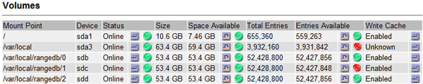

= Verwalten von Alarmen (Altsystem)
:allow-uri-read: 
:icons: font
:imagesdir: ../media/

[role="lead"]
Das StorageGRID-Alarmsystem ist das ältere System, mit dem Störstellen identifiziert werden können, die manchmal während des normalen Betriebs auftreten.

NOTE: Das alte Alarmsystem wird zwar weiterhin unterstützt, bietet jedoch deutliche Vorteile und ist einfacher zu bedienen.

== Alarmklassen (altes System)

Ein älterer Alarm kann zu einer von zwei sich gegenseitig ausschließenden Alarmklassen gehören.

* Standardalarme werden mit jedem StorageGRID-System geliefert und können nicht geändert werden. Sie können jedoch Standardalarme deaktivieren oder überschreiben, indem Sie globale benutzerdefinierte Alarme definieren.
* Globale benutzerdefinierte Alarme überwachen den Status aller Dienste eines bestimmten Typs im StorageGRID-System. Sie können einen globalen benutzerdefinierten Alarm erstellen, um einen Standardalarm zu überschreiben. Sie können auch einen neuen globalen benutzerdefinierten Alarm erstellen. Dies kann nützlich sein, um alle angepassten Bedingungen Ihres StorageGRID-Systems zu überwachen.

== Alarmauslöselogik (Älteres System)

Ein alter Alarm wird ausgelöst, wenn ein StorageGRID-Attribut einen Schwellenwert erreicht, der für eine Kombination aus Alarmklasse (Standard oder Global Custom) und Alarmschweregrade auf „true“ bewertet.

[cols="1a,1a,1a,3a"]
|===
| Symbol | Farbe | Alarmschweregrad | Bedeutung 

 a| 
image:../media/icon_alarm_yellow_notice.gif["Gelbes Quadrat-Symbol"]
 a| 
Gelb
 a| 
Hinweis
 a| 
Der Node ist mit dem Grid verbunden. Es ist jedoch eine ungewöhnliche Bedingung vorhanden, die den normalen Betrieb nicht beeinträchtigt.

 a| 
image:../media/icon_alert_yellow_minor.png["Hellorangefarbenes Diamantsymbol"]
 a| 
Hellorange
 a| 
Gering
 a| 
Der Node ist mit dem Raster verbunden, aber es existiert eine anormale Bedingung, die den Betrieb in Zukunft beeinträchtigen könnte. Sie sollten untersuchen, um eine Eskalation zu verhindern.

 a| 
image:../media/icon_alert_orange_major.png["Dunkles orangefarbenes Diamantsymbol"]
 a| 
Dunkelorange
 a| 
Major
 a| 
Der Node ist mit dem Grid verbunden. Es ist jedoch eine anormale Bedingung vorhanden, die sich derzeit auf den Betrieb auswirkt. Um eine Eskalation zu vermeiden, ist eine sofortige Aufmerksamkeit erforderlich.

 a| 
image:../media/icon_alert_red_critical.png["Rotes X-Symbol"]
 a| 
Rot
 a| 
Kritisch
 a| 
Der Node ist mit dem Grid verbunden. Es ist jedoch eine anormale Bedingung vorhanden, die normale Vorgänge angehalten hat. Sie sollten das Problem sofort beheben.

|===
Für jedes numerische Attribut kann der Alarmschwerwert und der entsprechende Schwellwert eingestellt werden. Der NMS-Service auf jedem Admin-Node überwacht kontinuierlich die aktuellen Attributwerte im Vergleich zu konfigurierten Schwellenwerten. Wenn ein Alarm ausgelöst wird, wird eine Benachrichtigung an alle designierten Mitarbeiter gesendet.

Beachten Sie, dass ein Schweregrad „Normal“ keinen Alarm auslöst.

Attributwerte werden anhand der Liste der aktivierten Alarme bewertet, die für dieses Attribut definiert wurden. Die Liste der Alarme wird in der folgenden Reihenfolge überprüft, um die erste Alarmklasse mit einem definierten und aktivierten Alarm für das Attribut zu finden:

. Globale benutzerdefinierte Alarme mit Alarmabtrennungen von kritisch bis zur Mitteilung.
. Standardalarme mit Alarmtrennungen von kritisch bis Notice.

Nachdem in der höheren Alarmklasse ein aktivierter Alarm für ein Attribut gefunden wurde, wird der NMS-Dienst nur innerhalb dieser Klasse ausgewertet. Der NMS-Dienst wird nicht mit den anderen Klassen mit niedrigerer Priorität bewertet. Wenn also ein globaler benutzerdefinierter Alarm für ein Attribut aktiviert ist, wertet der NMS-Dienst den Attributwert nur gegen globale benutzerdefinierte Alarme aus. Standardalarme werden nicht ausgewertet. Somit kann ein aktivierter Standardalarm für ein Attribut die Kriterien erfüllen, die zum Auslösen eines Alarms erforderlich sind. Er wird jedoch nicht ausgelöst, da ein globaler benutzerdefinierter Alarm (der nicht den angegebenen Kriterien entspricht) für dasselbe Attribut aktiviert ist. Es wird kein Alarm ausgelöst und keine Benachrichtigung gesendet.

=== Beispiel für Alarmauslösung

Anhand dieses Beispiels können Sie verstehen, wie globale benutzerdefinierte Alarme und Standardalarme ausgelöst werden.

Im folgenden Beispiel ist ein Attribut mit einem globalen benutzerdefinierten Alarm und einem Standardalarm definiert und aktiviert, wie in der folgenden Tabelle dargestellt.

[cols="1a,2a,2a"]
|===
|  | Globale benutzerdefinierte Alarmschwelle (aktiviert) | Standard-Alarmschwellenwert (aktiviert) 

 a| 
Hinweis
 a| 
>= 1500
 a| 
>= 1000

 a| 
Gering
 a| 
>= 15,000
 a| 
>= 1000

 a| 
Major
 a| 
>=150,000
 a| 
>= 250,000

|===
Wird das Attribut bei einem Wert von 1000 ausgewertet, wird kein Alarm ausgelöst und keine Benachrichtigung gesendet.

Der globale benutzerdefinierte Alarm hat Vorrang vor dem Standardalarm. Ein Wert von 1000 erreicht für den globalen benutzerdefinierten Alarm keinen Schwellenwert eines Schweregrads. Daher wird der Alarmpegel als normal bewertet.

Wenn nach dem obigen Szenario der globale benutzerdefinierte Alarm deaktiviert ist, ändert sich nichts. Der Attributwert muss neu bewertet werden, bevor eine neue Alarmstufe ausgelöst wird.

Wenn der globale benutzerdefinierte Alarm deaktiviert ist und der Attributwert neu bewertet wird, wird der Attributwert anhand der Schwellenwerte für den Standardalarm ausgewertet. Die Alarmstufe löst einen Alarm für die Benachrichtigungsstufe aus, und eine E-Mail-Benachrichtigung wird an das entsprechende Personal gesendet.

=== Alarme desselben Schweregrades

Wenn zwei globale benutzerdefinierte Alarme für dasselbe Attribut den gleichen Schweregrad aufweisen, werden die Alarme mit der Priorität „Top-Down“ ausgewertet.

Wenn UMEM beispielsweise auf 50 MB abfällt, wird der erste Alarm ausgelöst (= 50000000), nicht jedoch der untere Alarm (\<=100000000).

image::../media/alarm_order.gif[Beispiel Für Einen Globalen Benutzerdefinierten Alarm]

Wird die Reihenfolge umgekehrt, wenn UMEM auf 100MB fällt, wird der erste Alarm (\<=100000000) ausgelöst, nicht jedoch der darunter stehende Alarm (= 50000000).

image::../media/alarm_order_reversed.gif[Beispiel Für Einen Globalen Benutzerdefinierten Alarm]

=== Benachrichtigungen

Eine Benachrichtigung meldet das Auftreten eines Alarms oder die Änderung des Status eines Dienstes. Alarmbenachrichtigungen können per E-Mail oder über SNMP gesendet werden.

Um zu vermeiden, dass bei Erreichen eines Alarmschwellenwerts mehrere Alarme und Benachrichtigungen gesendet werden, wird der Schweregrad des Alarms anhand des aktuellen Alarmschwerfalls für das Attribut überprüft. Wenn es keine Änderung gibt, dann werden keine weiteren Maßnahmen ergriffen. Das bedeutet, dass der NMS-Dienst das System weiterhin überwacht, nur ein Alarm ausgelöst und Benachrichtigungen sendet, wenn er zum ersten Mal einen Alarmzustand für ein Attribut bemerkt. Wenn ein neuer Wertschwellenwert für das Attribut erreicht und erkannt wird, ändert sich der Schweregrad des Alarms und eine neue Benachrichtigung wird gesendet. Die Alarme werden gelöscht, wenn die Zustände wieder auf den normalen Stand zurückkehren.

Der in der Benachrichtigung über einen Alarmzustand angezeigte Triggerwert wird auf drei Dezimalstellen gerundet. Daher löst ein Attributwert von 1.9999 einen Alarm aus, dessen Schwellenwert unter (<) 2.0 liegt, obwohl die Alarmbenachrichtigung den Triggerwert als 2.0 anzeigt.

=== Neuer Services

Wenn neue Services durch Hinzufügen neuer Grid-Nodes oder -Standorte hinzugefügt werden, erben sie Standardalarme und globale benutzerdefinierte Alarme.

=== Alarme und Tabellen

In Tabellen angezeigte Alarmattribute können auf Systemebene deaktiviert werden. Alarme können für einzelne Zeilen in einer Tabelle nicht deaktiviert werden.

Die folgende Tabelle zeigt beispielsweise zwei kritische Einträge (VMFI)-Alarme. (Wählen Sie *SUPPORT* > *Tools* > *Grid-Topologie*. Wählen Sie dann *_Storage-Node_* > *SSM* > *Ressourcen*.)

Sie können den VMFI-Alarm so deaktivieren, dass der VMFI-Alarm der kritischen Stufe nicht ausgelöst wird (beide derzeit kritischen Alarme werden in der Tabelle grün angezeigt); Sie können jedoch einen einzelnen Alarm in einer Tabellenzeile nicht deaktivieren, sodass ein VMFI-Alarm als kritischer Alarmwert angezeigt wird, während der andere grün bleibt.

== Quittierung aktueller Alarme (Legacy-System)

Ältere Alarme werden ausgelöst, wenn Systemattribute die Alarmschwellenwerte erreichen. Wenn Sie die Liste der alten Alarme verringern oder löschen möchten, können Sie die Alarme bestätigen.

.Bevor Sie beginnen
* Sie müssen mit einem beim Grid Manager angemeldet sein link:../admin/web-browser-requirements.html["Unterstützter Webbrowser"].
* Sie müssen über die Berechtigung zum Quittieren von Alarmen verfügen.

.Über diese Aufgabe
Da das alte Alarmsystem weiterhin unterstützt wird, wird die Liste der alten Alarme auf der Seite Aktuelle Alarme bei jedem neuen Alarm erhöht. Sie können die Alarme in der Regel ignorieren (da Alarme eine bessere Sicht auf das System bieten) oder die Alarme quittieren.

NOTE: Wenn Sie auf das Alarmsystem umgestellt haben, können Sie optional jeden älteren Alarm deaktivieren, um zu verhindern, dass er ausgelöst wird und der Anzahl der älteren Alarme hinzugefügt wird.

Wenn Sie einen Alarm quittieren, wird er nicht mehr auf der Seite „Aktuelle Alarme“ im Grid Manager aufgeführt, es sei denn, der Alarm wird auf der nächsten Schweregrade ausgelöst oder behoben und tritt erneut auf.

NOTE: Das alte Alarmsystem wird zwar weiterhin unterstützt, bietet jedoch deutliche Vorteile und ist einfacher zu bedienen.

.Schritte
. Wählen Sie *SUPPORT* > *Alarme (alt)* > *Aktueller Alarm* aus.
+
image::../media/current_alarms_page.png[Seite „Aktuelle Alarme“]

. Wählen Sie in der Tabelle den Dienstnamen aus.
+
Die Registerkarte Alarme für den ausgewählten Dienst wird angezeigt (*SUPPORT* > *Tools* > *Grid Topology* > *_Grid Node_* > *_Service_* > *Alarme*).

+
image::../media/alarms_acknowledging.png[Alarme Quittieren]

. Aktivieren Sie das Kontrollkästchen *quittieren* für den Alarm, und klicken Sie auf *Änderungen übernehmen*.
+
Der Alarm wird nicht mehr auf dem Armaturenbrett oder der Seite Aktuelle Alarme angezeigt.

+

NOTE: Wenn Sie einen Alarm bestätigen, wird die Quittierung nicht auf andere Admin-Knoten kopiert. Wenn Sie das Dashboard von einem anderen Admin-Knoten aus anzeigen, wird der aktive Alarm möglicherweise weiterhin angezeigt.

. Zeigen Sie bei Bedarf bestätigte Alarme an.
+
.. Wählen Sie *SUPPORT* > *Alarme (alt)* > *Aktueller Alarm* aus.
.. Wählen Sie *Bestätigte Alarme Anzeigen*.
+
Alle quittierten Alarme werden angezeigt.

+
image::../media/current_alarms_page_show_acknowledged.png[Die Seite „Aktuelle Alarme“ Wird Bestätigt Angezeigt]

== Standardalarme anzeigen (Altsystem)

Sie können die Liste aller älteren Standardalarme anzeigen.

.Bevor Sie beginnen
* Sie müssen mit einem beim Grid Manager angemeldet sein link:../admin/web-browser-requirements.html["Unterstützter Webbrowser"].
* Das ist schon link:../admin/admin-group-permissions.html["Bestimmte Zugriffsberechtigungen"].

NOTE: Das alte Alarmsystem wird zwar weiterhin unterstützt, bietet jedoch deutliche Vorteile und ist einfacher zu bedienen.

.Schritte
. Wählen Sie *SUPPORT* > *Alarme (alt)* > *Globale Alarme*.
. Wählen Sie für Filter by die Option *Attributcode* oder *Attributname* aus.
. Geben Sie für gleich ein Sternchen ein: `*`
. Klicken Sie auf den Pfeil image:../media/icon_nms_right_arrow.gif["Pfeilsymbol"] Oder drücken Sie *Enter*.
+
Alle Standardalarme werden aufgelistet.

+
image::../media/global_alarms.gif[Seite „Globale Alarme“]

== Prüfen historischer Alarme und Alarmfrequenz (altes System)

Bei der Fehlerbehebung eines Problems können Sie überprüfen, wie oft in der Vergangenheit ein älterer Alarm ausgelöst wurde.

.Bevor Sie beginnen
* Sie müssen mit einem beim Grid Manager angemeldet sein link:../admin/web-browser-requirements.html["Unterstützter Webbrowser"].
* Das ist schon link:../admin/admin-group-permissions.html["Bestimmte Zugriffsberechtigungen"].

NOTE: Das alte Alarmsystem wird zwar weiterhin unterstützt, bietet jedoch deutliche Vorteile und ist einfacher zu bedienen.

.Schritte
. Führen Sie diese Schritte aus, um eine Liste aller Alarme zu erhalten, die über einen bestimmten Zeitraum ausgelöst wurden.
+
.. Wählen Sie *SUPPORT* > *Alarme (alt)* > *Historische Alarme*.
.. Führen Sie einen der folgenden Schritte aus:
+
*** Klicken Sie auf einen der Zeiträume.
*** Geben Sie einen benutzerdefinierten Bereich ein, und klicken Sie auf *Benutzerdefinierte Abfrage*.

. Befolgen Sie diese Schritte, um herauszufinden, wie oft Alarme für ein bestimmtes Attribut ausgelöst wurden.
+
.. Wählen Sie *SUPPORT* > *Tools* > *Grid-Topologie* aus.
.. Wählen Sie *_Grid Node_* > *_Service oder Component_* > *Alarme* > *Historie* aus.
.. Wählen Sie das Attribut aus der Liste aus.
.. Führen Sie einen der folgenden Schritte aus:
+
*** Klicken Sie auf einen der Zeiträume.
*** Geben Sie einen benutzerdefinierten Bereich ein, und klicken Sie auf *Benutzerdefinierte Abfrage*.
+
Die Alarme werden in umgekehrter chronologischer Reihenfolge aufgeführt.

.. Um zum Formular für die Anforderung des Alarmverlaufs zurückzukehren, klicken Sie auf *Historie*.

== Globale benutzerdefinierte Alarme erstellen (altes System)

Sie haben möglicherweise globale benutzerdefinierte Alarme für das alte System verwendet, um bestimmte Überwachungsanforderungen zu erfüllen. Globale benutzerdefinierte Alarme können Alarmstufen haben, die Standardalarme überschreiben oder Attribute überwachen, die keinen Standardalarm haben.

.Bevor Sie beginnen
* Sie müssen mit einem beim Grid Manager angemeldet sein link:../admin/web-browser-requirements.html["Unterstützter Webbrowser"].
* Das ist schon link:../admin/admin-group-permissions.html["Bestimmte Zugriffsberechtigungen"].

NOTE: Das alte Alarmsystem wird zwar weiterhin unterstützt, bietet jedoch deutliche Vorteile und ist einfacher zu bedienen.

Globale benutzerdefinierte Alarme überschreiben Standardalarme. Sie sollten die Standardalarmwerte nur dann ändern, wenn dies unbedingt erforderlich ist. Durch Ändern der Standardalarme besteht die Gefahr, Probleme zu verbergen, die sonst einen Alarm auslösen könnten.

NOTE: Seien Sie vorsichtig, wenn Sie die Alarmeinstellungen ändern. Wenn Sie beispielsweise den Schwellenwert für einen Alarm erhöhen, können Sie ein zugrunde liegendes Problem möglicherweise nicht erkennen. Besprechen Sie Ihre vorgeschlagenen Änderungen mit dem technischen Support, bevor Sie eine Alarmeinstellung ändern.

.Schritte
. Wählen Sie *SUPPORT* > *Alarme (alt)* > *Globale Alarme*.
. Neue Zeile zur Tabelle „Globale benutzerdefinierte Alarme“ hinzufügen:
+
** Um einen neuen Alarm hinzuzufügen, klicken Sie auf *Bearbeiten* image:../media/icon_nms_edit.gif["Symbol bearbeiten"] (Wenn dies der erste Eintrag ist) oder *Einfügen* image:../media/icon_nms_insert.gif["Symbol einfügen"].
+

** Um einen Standardalarm zu ändern, suchen Sie nach dem Standardalarm.
+
... Wählen Sie unter Filter by entweder *Attributcode* oder *Attributname* aus.
... Geben Sie einen Suchstring ein.
+
Geben Sie vier Zeichen an oder verwenden Sie Platzhalter (z. B. A????). Oder ab*). Sternchen (*) stellen mehrere Zeichen dar und Fragezeichen (?) Stellt ein einzelnes Zeichen dar.

... Klicken Sie auf den Pfeil image:../media/icon_nms_right_arrow.gif["Nach-rechts-Pfeil-Symbol"]Oder drücken Sie *Enter*.
... Klicken Sie in der Ergebnisliste auf *Kopieren* image:../media/icon_nms_copy.gif["Symbol kopieren"] Neben dem Alarm, den Sie ändern möchten.
+
Der Standardalarm wird in die Tabelle „Globale benutzerdefinierte Alarme“ kopiert.

. Nehmen Sie alle erforderlichen Änderungen an den Einstellungen für globale benutzerdefinierte Alarme vor:
+
[cols="1a,2a"]
|===
| Überschrift | Beschreibung 

 a| 
Aktiviert
 a| 
Aktivieren oder deaktivieren Sie das Kontrollkästchen, um den Alarm zu aktivieren oder zu deaktivieren.

 a| 
Attribut
 a| 
Wählen Sie den Namen und den Code des zu überwachenden Attributs aus der Liste aller Attribute aus, die für den ausgewählten Dienst oder die ausgewählte Komponente gelten.
Um Informationen über das Attribut anzuzeigen, klicken Sie auf *Info* image:../media/icon_nms_info.gif["Informationssymbol"] Neben dem Namen des Attributs.

 a| 
Schweregrad
 a| 
Das Symbol und der Text, der die Alarmstufe angibt.

 a| 
Nachricht
 a| 
Der Grund für den Alarm (Verbindung unterbrochen, Lagerraum unter 10 % usw.).

 a| 
Operator
 a| 
Operatoren für das Testen des aktuellen Attributwerts gegen den Wert-Schwellenwert:

** = gleich
** > größer als
** < kleiner als
** >= größer als oder gleich
** \<= kleiner als oder gleich
** ≠ ist nicht gleich

 a| 
Wert
 a| 
Der Schwellwert des Alarms, der zum Testen mit dem tatsächlichen Wert des Attributs über den Operator verwendet wird.
Die Eingabe kann eine einzelne Zahl, eine Reihe von Zahlen mit einem Doppelpunkt (1:3) oder eine kommagetrennte Liste von Zahlen und Bereichen sein.

 a| 
Zusätzliche Empfänger
 a| 
Eine zusätzliche Liste der E-Mail-Adressen, die bei Auslösung des Alarms benachrichtigt werden sollen. Dies ist zusätzlich zur Mailingliste, die auf der Seite *Alarme* > *E-Mail-Einrichtung* konfiguriert ist. Listen sind durch Komma abgegrenzt.

*Hinweis:* Mailinglisten erfordern die Einrichtung des SMTP-Servers. Bestätigen Sie vor dem Hinzufügen von Mailinglisten, dass SMTP konfiguriert ist.
Benachrichtigungen für benutzerdefinierte Alarme können Benachrichtigungen von globalen benutzerdefinierten oder Standardalarmen überschreiben.

 a| 
Aktionen
 a| 
Steuertasten zu:    image:../media/icon_nms_edit.gif["Symbol bearbeiten"] Bearbeiten Sie eine Zeile

+
image:../media/icon_nms_insert.gif["Symbol einfügen"] Eine Zeile einfügen

+
image:../media/icon_nms_delete.gif["Symbol Löschen"] Löschen Sie eine Zeile

+
image:../media/icon_nms_drag_and_drop.gif["Symbol ziehen"] Ziehen Sie eine Zeile nach oben oder unten

+
image:../media/icon_nms_copy.gif["Symbol kopieren"] Kopieren Sie eine Zeile

|===
. Klicken Sie Auf *Änderungen Übernehmen*.

== Deaktivieren von Alarmen (Legacy-System)

Die Alarme im alten Alarmsystem sind standardmäßig aktiviert, Sie können jedoch Alarme deaktivieren, die nicht erforderlich sind. Sie können auch die älteren Alarme deaktivieren, nachdem Sie vollständig auf das neue Alarmsystem umgestellt haben.

NOTE: Das alte Alarmsystem wird zwar weiterhin unterstützt, bietet jedoch deutliche Vorteile und ist einfacher zu bedienen.

=== Deaktivieren eines Standardalarms (Legacy-System)

Sie können einen der älteren Standardalarme für das gesamte System deaktivieren.

.Bevor Sie beginnen
* Sie müssen mit einem beim Grid Manager angemeldet sein link:../admin/web-browser-requirements.html["Unterstützter Webbrowser"].
* Das ist schon link:../admin/admin-group-permissions.html["Bestimmte Zugriffsberechtigungen"].

.Über diese Aufgabe
Durch Deaktivieren eines Alarms für ein Attribut, das derzeit über einen Alarm ausgelöst wird, wird der aktuelle Alarm nicht gelöscht. Der Alarm wird deaktiviert, wenn das Attribut das nächste Mal den Alarmschwellenwert überschreitet, oder Sie können den ausgelösten Alarm löschen.

NOTE: Deaktivieren Sie keine der älteren Alarme, bis Sie vollständig auf das neue Alarmsystem umgestellt haben. Andernfalls wird ein zugrunde liegendes Problem möglicherweise erst erkannt, wenn ein kritischer Vorgang nicht abgeschlossen wurde.

.Schritte
. Wählen Sie *SUPPORT* > *Alarme (alt)* > *Globale Alarme*.
. Suchen Sie nach dem Standardalarm, der deaktiviert werden soll.
+
.. Wählen Sie im Abschnitt Standardalarme die Option *Filtern nach* > *Attributcode* oder *Attributname* aus.
.. Geben Sie einen Suchstring ein.
+
Geben Sie vier Zeichen an oder verwenden Sie Platzhalter (z. B. A????). Oder ab*). Sternchen (*) stellen mehrere Zeichen dar und Fragezeichen (?) Stellt ein einzelnes Zeichen dar.

.. Klicken Sie auf den Pfeil image:../media/icon_nms_right_arrow.gif["Nach-rechts-Pfeil-Symbol"]Oder drücken Sie *Enter*.

+

NOTE: Wenn Sie *deaktivierte Standardeinstellungen* auswählen, wird eine Liste aller derzeit deaktivierten Standardalarme angezeigt.

. Klicken Sie in der Tabelle mit den Suchergebnissen auf das Symbol Bearbeiten image:../media/icon_nms_edit.gif["Symbol bearbeiten"] Für den Alarm, den Sie deaktivieren möchten.
+
image::../media/disable_default_alarm_global.gif[Seite „Globale Alarme“]

+
Das Kontrollkästchen *enabled* für den ausgewählten Alarm wird aktiviert.

. Deaktivieren Sie das Kontrollkästchen *aktiviert*.
. Klicken Sie Auf *Änderungen Übernehmen*.
+
Der Standardalarm ist deaktiviert.

=== Globale benutzerdefinierte Alarme deaktivieren (Legacy-System)

Sie können einen veralteten globalen benutzerdefinierten Alarm für das gesamte System deaktivieren.

.Bevor Sie beginnen
* Sie müssen mit einem beim Grid Manager angemeldet sein link:../admin/web-browser-requirements.html["Unterstützter Webbrowser"].
* Das ist schon link:../admin/admin-group-permissions.html["Bestimmte Zugriffsberechtigungen"].

.Über diese Aufgabe
Durch Deaktivieren eines Alarms für ein Attribut, das derzeit über einen Alarm ausgelöst wird, wird der aktuelle Alarm nicht gelöscht. Der Alarm wird deaktiviert, wenn das Attribut das nächste Mal den Alarmschwellenwert überschreitet, oder Sie können den ausgelösten Alarm löschen.

.Schritte
. Wählen Sie *SUPPORT* > *Alarme (alt)* > *Globale Alarme*.
. Klicken Sie in der Tabelle Globale benutzerdefinierte Alarme auf *Bearbeiten* image:../media/icon_nms_edit.gif["Symbol bearbeiten"] Neben dem Alarm, den Sie deaktivieren möchten.
. Deaktivieren Sie das Kontrollkästchen *aktiviert*.
+
image::../media/disable_global_custom_alarm.gif[Seite „Globale Alarme“]

. Klicken Sie Auf *Änderungen Übernehmen*.
+
Der globale benutzerdefinierte Alarm ist deaktiviert.

=== Ausgelöste Alarme löschen (Legacy-System)

Wenn ein älterer Alarm ausgelöst wird, können Sie ihn löschen, anstatt ihn zu bestätigen.

.Bevor Sie beginnen
* Sie müssen die haben ``Passwords.txt`` Datei:

Durch Deaktivieren eines Alarms für ein Attribut, das derzeit einen Alarm ausgelöst hat, wird der Alarm nicht gelöscht. Bei der nächsten Änderung des Attributs wird der Alarm deaktiviert. Sie können den Alarm bestätigen oder, wenn Sie den Alarm sofort löschen möchten, anstatt zu warten, bis sich der Attributwert ändert (was zu einer Änderung des Alarmstatus führt), können Sie den ausgelösten Alarm löschen. Dies ist hilfreich, wenn Sie einen Alarm sofort gegen ein Attribut löschen möchten, dessen Wert sich nicht oft ändert (z. B. Attribute für den Status).

. Deaktivieren Sie den Alarm.
. Melden Sie sich beim primären Admin-Node an:
+
.. Geben Sie den folgenden Befehl ein: `_ssh admin@primary_Admin_Node_IP_`
.. Geben Sie das im aufgeführte Passwort ein ``Passwords.txt`` Datei:
.. Geben Sie den folgenden Befehl ein, um zum Root zu wechseln: `su -`
.. Geben Sie das im aufgeführte Passwort ein `Passwords.txt` Datei:
+
Wenn Sie als root angemeldet sind, ändert sich die Eingabeaufforderung von `$` Bis `#`.

. Starten Sie den NMS-Service neu: `service nms restart`
. Melden Sie sich beim Admin-Knoten ab: `exit`
+
Der Alarm wurde gelöscht.

== Benachrichtigungen für Alarme konfigurieren (Altsystem)

StorageGRID System kann automatisch E-Mails und senden link:using-snmp-monitoring.html["SNMP-Benachrichtigungen"] Wenn ein Alarm ausgelöst wird oder sich ein Servicenstatus ändert.

Standardmäßig werden keine Alarm-E-Mail-Benachrichtigungen gesendet. Für E-Mail-Benachrichtigungen müssen Sie den E-Mail-Server konfigurieren und die E-Mail-Empfänger angeben. Für SNMP-Benachrichtigungen müssen Sie den SNMP-Agent konfigurieren.

=== Arten von Alarmanmeldungen (Legacy-System)

Wenn ein älterer Alarm ausgelöst wird, sendet das StorageGRID System zwei Arten von Alarmmeldungen: Schweregrad und Service-Status.

==== Benachrichtigungen auf Schweregraden

Eine Alarm-E-Mail-Benachrichtigung wird gesendet, wenn ein älterer Alarm auf einer ausgewählten Schweregrade ausgelöst wird:

* Hinweis
* Gering
* Major
* Kritisch

Eine Mailingliste erhält alle Benachrichtigungen, die sich auf den Alarm für den ausgewählten Schweregrad beziehen. Eine Benachrichtigung wird auch gesendet, wenn der Alarm den Alarmpegel verlässt – entweder durch eine Lösung oder durch Eingabe eines anderen Schweregrads.

==== Service-Status-Benachrichtigungen

Eine Benachrichtigung über den Servicenstatus wird gesendet, wenn ein Dienst (z. B. der LDR-Dienst oder der NMS-Dienst) den ausgewählten Servicenstatus eingibt und den ausgewählten Servicenstatus verlässt. Dienststatus-Benachrichtigungen werden gesendet, wenn ein Dienst einen der folgenden Servicenstatus eingibt oder verlässt:

* Unbekannt
* Administrativ Nach Unten

Eine Mailingliste erhält alle Benachrichtigungen, die sich auf Änderungen im ausgewählten Status beziehen.

=== E-Mail-Servereinstellungen für Alarme konfigurieren (Legacy-System)

Wenn StorageGRID E-Mail-Benachrichtigungen senden soll, wenn ein älterer Alarm ausgelöst wird, müssen Sie die SMTP-Mail-Server-Einstellungen angeben. Das StorageGRID System sendet nur E-Mails, es kann keine E-Mails empfangen.

.Bevor Sie beginnen
* Sie müssen mit einem beim Grid Manager angemeldet sein link:../admin/web-browser-requirements.html["Unterstützter Webbrowser"].
* Das ist schon link:../admin/admin-group-permissions.html["Bestimmte Zugriffsberechtigungen"].

.Über diese Aufgabe
Verwenden Sie diese Einstellungen, um den SMTP-Server zu definieren, der für ältere E-Mail-Benachrichtigungen und AutoSupport-E-Mail-Nachrichten verwendet wird. Diese Einstellungen werden nicht für Warnmeldungen verwendet.

NOTE: Wenn Sie SMTP als Protokoll für AutoSupport-Pakete verwenden, haben Sie möglicherweise bereits einen SMTP-Mailserver konfiguriert. Derselbe SMTP-Server wird für Benachrichtigungen über Alarm-E-Mails verwendet, sodass Sie diesen Vorgang überspringen können. Siehe link:../admin/index.html["Anweisungen für die Administration von StorageGRID"].

SMTP ist das einzige Protokoll, das zum Senden von E-Mails unterstützt wird.

.Schritte
. Wählen Sie *SUPPORT* > *Alarme (alt)* > *Legacy E-Mail-Einrichtung*.
. Wählen Sie im Menü E-Mail die Option *Server* aus.
+
Die Seite E-Mail-Server wird angezeigt. Diese Seite wird auch verwendet, um den E-Mail-Server für AutoSupport-Pakete zu konfigurieren.

+
image::../media/email_server_settings.png[E-Mail-Server-Einstellungen]

. Fügen Sie die folgenden SMTP-Mail-Server-Einstellungen hinzu:
+
[cols="1a,2a"]
|===
| Element | Beschreibung 

 a| 
Mailserver
 a| 
IP-Adresse des SMTP-Mail-Servers. Sie können anstelle einer IP-Adresse einen Hostnamen eingeben, wenn Sie zuvor DNS-Einstellungen auf dem Admin-Knoten konfiguriert haben.

 a| 
Port
 a| 
Portnummer für den Zugriff auf den SMTP-Mail-Server.

 a| 
Authentifizierung
 a| 
Ermöglicht die Authentifizierung des SMTP-Mail-Servers. Standardmäßig ist die Authentifizierung deaktiviert.

 a| 
Authentifizierungsdaten
 a| 
Benutzername und Passwort des SMTP-Mail-Servers. Wenn die Authentifizierung auf ein festgelegt ist, müssen ein Benutzername und ein Passwort für den Zugriff auf den SMTP-Mail-Server angegeben werden.

|===
. Geben Sie unter *von Address* eine gültige E-Mail-Adresse ein, die der SMTP-Server als sendende E-Mail-Adresse erkennt. Dies ist die offizielle E-Mail-Adresse, von der die E-Mail-Nachricht gesendet wird.
. Senden Sie optional eine Test-E-Mail, um zu bestätigen, dass die SMTP-Mail-Servereinstellungen korrekt sind.
+
.. Fügen Sie im Feld *E-Mail-Test* > *bis* eine oder mehrere Adressen hinzu, auf die Sie zugreifen können.
+
Sie können eine einzelne E-Mail-Adresse oder eine kommagetrennte Liste von E-Mail-Adressen eingeben. Da der NMS-Dienst den Erfolg oder Fehler beim Senden einer Test-E-Mail nicht bestätigt, müssen Sie den Posteingang des Testempfängers überprüfen können.

.. Wählen Sie *Test-E-Mail senden*.

. Klicken Sie Auf *Änderungen Übernehmen*.
+
Die SMTP-Mail-Server-Einstellungen werden gespeichert. Wenn Sie Informationen für eine Test-E-Mail eingegeben haben, wird diese E-Mail gesendet. Test-E-Mails werden sofort an den Mailserver gesendet und nicht über die Benachrichtigungswarteschlange gesendet. In einem System mit mehreren Admin-Nodes sendet jeder Admin-Node eine E-Mail. Der Empfang der Test-E-Mail bestätigt, dass Ihre SMTP-Mail-Server-Einstellungen korrekt sind und dass der NMS-Dienst erfolgreich eine Verbindung zum Mail-Server herstellt. Ein Verbindungsproblem zwischen dem NMS-Dienst und dem Mail-Server löst den Alarm für ältere MINUTEN (NMS Notification Status) auf der Stufe mit dem Schweregrad „Minor“ aus.

=== E-Mail-Vorlagen für Alarme erstellen (altes System)

Mithilfe von E-Mail-Vorlagen können Sie die Kopfzeile, Fußzeile und den Betreff einer früheren Alarm-E-Mail-Benachrichtigung anpassen. Sie können E-Mail-Vorlagen verwenden, um eindeutige Benachrichtigungen zu senden, die denselben Text an verschiedene Mailinglisten enthalten.

.Bevor Sie beginnen
* Sie müssen mit einem beim Grid Manager angemeldet sein link:../admin/web-browser-requirements.html["Unterstützter Webbrowser"].
* Das ist schon link:../admin/admin-group-permissions.html["Bestimmte Zugriffsberechtigungen"].

.Über diese Aufgabe
Mit diesen Einstellungen können Sie die E-Mail-Vorlagen festlegen, die für ältere Benachrichtigungen verwendet werden. Diese Einstellungen werden nicht für Warnmeldungen verwendet.

Für unterschiedliche Mailinglisten sind möglicherweise andere Kontaktinformationen erforderlich. Vorlagen enthalten keinen Haupttext der E-Mail-Nachricht.

.Schritte
. Wählen Sie *SUPPORT* > *Alarme (alt)* > *Legacy E-Mail-Einrichtung*.
. Wählen Sie im Menü E-Mail die Option *Vorlagen*.
. Klicken Sie Auf *Bearbeiten* image:../media/icon_nms_edit.gif["Symbol bearbeiten"] (Oder *Einfügen* image:../media/icon_nms_insert.gif["Symbol einfügen"] Falls dies nicht die erste Vorlage ist).
+
image::../media/edit_email_templates.gif[Seite für E-Mail-Vorlagen]

. Fügen Sie in der neuen Zeile Folgendes hinzu:
+
[cols="1a,2a"]
|===
| Element | Beschreibung 

 a| 
Vorlagenname
 a| 
Eindeutiger Name zur Identifizierung der Vorlage. Vorlagennamen können nicht dupliziert werden.

 a| 
Präfix Für Betreff
 a| 
Optional Präfix, das am Anfang der Betreffzeile einer E-Mail angezeigt wird. Mit Präfixen können E-Mail-Filter einfach konfiguriert und Benachrichtigungen organisiert werden.

 a| 
Kopfzeile
 a| 
Optional Kopfzeilentext, der am Anfang des E-Mail-Nachrichtentextes erscheint. Der Kopfzeilentext kann verwendet werden, um den Inhalt der E-Mail-Nachricht mit Informationen wie Firmenname und Adresse zu versehen.

 a| 
Fußzeile
 a| 
Optional Fußzeilentext, der am Ende des E-Mail-Nachrichtentexts angezeigt wird. Über Fußzeile können Sie die eMail-Nachricht mit Erinnerungsdaten wie einer Telefonnummer oder einem Link zu einer Website schließen.

|===
. Klicken Sie Auf *Änderungen Übernehmen*.
+
Es wird eine neue Vorlage für Benachrichtigungen hinzugefügt.

=== Erstellen von Mailinglisten für Alarmbenachrichtigungen (Altsystem)

Mit Mailinglisten können Sie Empfänger benachrichtigen, wenn ein älterer Alarm ausgelöst wird oder wenn sich ein Servicenstatus ändert. Sie müssen mindestens eine Mailingliste erstellen, bevor Sie Alarm-E-Mail-Benachrichtigungen senden können. Um eine Benachrichtigung an einen einzelnen Empfänger zu senden, erstellen Sie eine Mailingliste mit einer E-Mail-Adresse.

.Bevor Sie beginnen
* Sie müssen mit einem beim Grid Manager angemeldet sein link:../admin/web-browser-requirements.html["Unterstützter Webbrowser"].
* Das ist schon link:../admin/admin-group-permissions.html["Bestimmte Zugriffsberechtigungen"].
* Wenn Sie eine E-Mail-Vorlage für die Mailingliste (benutzerdefinierte Kopfzeile, Fußzeile und Betreffzeile) angeben möchten, müssen Sie die Vorlage bereits erstellt haben.

.Über diese Aufgabe
Mit diesen Einstellungen können Sie die Mailinglisten definieren, die für Benachrichtigungen über ältere E-Mails verwendet werden. Diese Einstellungen werden nicht für Warnmeldungen verwendet.

.Schritte
. Wählen Sie *SUPPORT* > *Alarme (alt)* > *Legacy E-Mail-Einrichtung*.
. Wählen Sie im Menü E-Mail die Option *Listen* aus.
. Klicken Sie Auf *Bearbeiten* image:../media/icon_nms_edit.gif["Symbol bearbeiten"] (Oder *Einfügen*image:../media/icon_nms_insert.gif["Symbol einfügen"] Falls dies nicht die erste Mailingliste ist).
+
image::../media/email_lists_page.gif[Seite „E-Mail-Listen“]

. Fügen Sie in der neuen Zeile Folgendes hinzu:
+
[cols="1a,2a"]
|===
| Element | Beschreibung 

 a| 
Gruppenname
 a| 
Eindeutiger Name zur Identifizierung der Mailingliste. Mailinglistennamen können nicht dupliziert werden.

*Hinweis:* Wenn Sie den Namen einer Mailingliste ändern, wird die Änderung nicht an die anderen Standorte weitergegeben, die den Namen der Mailingliste verwenden. Sie müssen alle konfigurierten Benachrichtigungen manuell aktualisieren, um den neuen Namen der Mailingliste zu verwenden.

 a| 
Empfänger
 a| 
Eine einzelne E-Mail-Adresse, eine zuvor konfigurierte Mailingliste oder eine kommagetrennte Liste von E-Mail-Adressen und Mailinglisten, an die Benachrichtigungen gesendet werden.

*Hinweis:* Wenn eine E-Mail-Adresse zu mehreren Mailinglisten gehört, wird nur eine E-Mail-Benachrichtigung gesendet, wenn ein Benachrichtigungserlösungs-Ereignis auftritt.

 a| 
Vorlage
 a| 
Wählen Sie optional eine E-Mail-Vorlage aus, um eine eindeutige Kopfzeile, Fußzeile und Betreffzeile zu Benachrichtigungen hinzuzufügen, die an alle Empfänger dieser Mailingliste gesendet werden.

|===
. Klicken Sie Auf *Änderungen Übernehmen*.
+
Es wird eine neue Mailingliste erstellt.

=== E-Mail-Benachrichtigungen für Alarme konfigurieren (Legacy-System)

Um E-Mail-Benachrichtigungen für das ältere Alarmsystem zu erhalten, müssen die Empfänger Mitglied einer Mailingliste sein und diese Liste zur Seite Benachrichtigungen hinzugefügt werden. Benachrichtigungen werden so konfiguriert, dass E-Mails nur dann an Empfänger gesendet werden, wenn ein Alarm mit einem bestimmten Schweregrad ausgelöst wird oder wenn sich ein Servicenstatus ändert. Empfänger erhalten somit nur die Benachrichtigungen, die sie erhalten müssen.

.Bevor Sie beginnen
* Sie müssen mit einem beim Grid Manager angemeldet sein link:../admin/web-browser-requirements.html["Unterstützter Webbrowser"].
* Das ist schon link:../admin/admin-group-permissions.html["Bestimmte Zugriffsberechtigungen"].
* Sie müssen eine E-Mail-Liste konfiguriert haben.

.Über diese Aufgabe
Mit diesen Einstellungen können Sie Benachrichtigungen für ältere Alarme konfigurieren. Diese Einstellungen werden nicht für Warnmeldungen verwendet.

Wenn eine E-Mail-Adresse (oder eine Liste) zu mehreren Mailinglisten gehört, wird nur eine E-Mail-Benachrichtigung gesendet, wenn ein Ereignis auftritt, bei dem eine Benachrichtigung ausgelöst wird. So kann beispielsweise eine Gruppe von Administratoren in Ihrem Unternehmen so konfiguriert werden, dass sie Benachrichtigungen für alle Alarme unabhängig vom Schweregrad erhalten. Eine andere Gruppe benötigt möglicherweise nur Benachrichtigungen für Alarme mit einem Schweregrad von „kritisch“. Sie können zu beiden Listen gehören. Wenn ein kritischer Alarm ausgelöst wird, erhalten Sie nur eine Benachrichtigung.

.Schritte
. Wählen Sie *SUPPORT* > *Alarme (alt)* > *Legacy E-Mail-Einrichtung*.
. Wählen Sie im Menü E-Mail die Option *Benachrichtigungen* aus.
. Klicken Sie Auf *Bearbeiten*image:../media/icon_nms_edit.gif["Symbol bearbeiten"] (Oder *Einfügen*image:../media/icon_nms_insert.gif["Symbol einfügen"] Wenn dies nicht die erste Benachrichtigung ist).
. Wählen Sie unter E-Mail-Liste die Mailingliste aus.
. Wählen Sie eine oder mehrere Alarmschweregrade und Servicestufen aus.
. Klicken Sie Auf *Änderungen Übernehmen*.
+
Benachrichtigungen werden an die Mailingliste gesendet, wenn Alarme mit dem ausgewählten Schweregrad „Alarm“ oder „Service“ ausgelöst oder geändert werden.

=== Alarmbenachrichtigungen für eine Mailingliste unterdrücken (Älteres System)

Sie können Alarmbenachrichtigungen für eine Mailingliste unterdrücken, wenn Sie nicht mehr möchten, dass die Mailingliste Benachrichtigungen über Alarme erhalten. Beispielsweise möchten Sie Benachrichtigungen über ältere Alarme unterdrücken, nachdem Sie zu Warnmeldungen gewechselt haben.

.Bevor Sie beginnen
* Sie müssen mit einem beim Grid Manager angemeldet sein link:../admin/web-browser-requirements.html["Unterstützter Webbrowser"].
* Das ist schon link:../admin/admin-group-permissions.html["Bestimmte Zugriffsberechtigungen"].

Verwenden Sie diese Einstellungen, um E-Mail-Benachrichtigungen für das ältere Alarmsystem zu unterdrücken. Diese Einstellungen gelten nicht für E-Mail-Benachrichtigungen.

NOTE: Das alte Alarmsystem wird zwar weiterhin unterstützt, bietet jedoch deutliche Vorteile und ist einfacher zu bedienen.

.Schritte
. Wählen Sie *SUPPORT* > *Alarme (alt)* > *Legacy E-Mail-Einrichtung*.
. Wählen Sie im Menü E-Mail die Option *Benachrichtigungen* aus.
. Klicken Sie Auf *Bearbeiten* image:../media/icon_nms_edit.gif["Symbol bearbeiten"] Neben der Mailingliste, für die Sie Benachrichtigungen unterdrücken möchten.
. Aktivieren Sie unter unterdrücken das Kontrollkästchen neben der Mailingliste, die Sie unterdrücken möchten, oder wählen Sie *unterdrücken* oben in der Spalte, um alle Mailinglisten zu unterdrücken.
. Klicken Sie Auf *Änderungen Übernehmen*.
+
Ältere Alarmbenachrichtigungen werden für die ausgewählten Mailinglisten unterdrückt.

