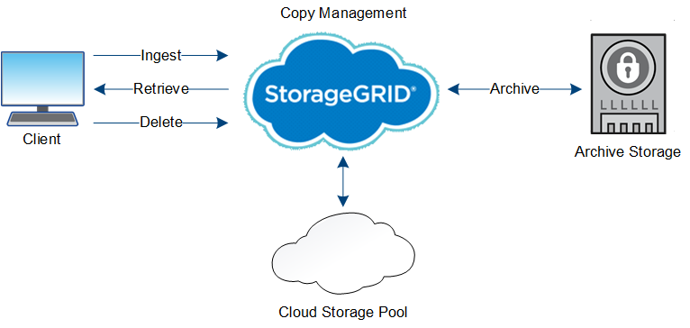

= Das Leben eines Objekts
:allow-uri-read: 
:icons: font
:imagesdir: ../media/

[role="lead"]
Das Leben eines Objekts besteht aus verschiedenen Etappen. Jede Phase stellt die Vorgänge dar, die mit dem Objekt auftreten.

Der Lebenszyklus eines Objekts umfasst das Aufnehmen, das Kopieren-Management, das Abrufen und Löschen von Objekten.

* *Ingest*: Der Prozess einer S3- oder Swift-Client-Anwendung, bei der ein Objekt über HTTP auf das StorageGRID-System gespeichert wird. In dieser Phase beginnt das StorageGRID-System mit der Verwaltung des Objekts.
* *Copy-Management*: Management replizierter und mit Erasure-Coded-Kopien in StorageGRID, wie in den ILM-Regeln der aktiven ILM-Richtlinien beschrieben. Während der Kopiemanagementphase schützt StorageGRID Objektdaten vor Verlust. Dazu wird die angegebene Anzahl und der angegebene Typ von Objektkopien auf Storage-Nodes, in einem Cloud-Storage-Pool oder auf Archiv-Node erstellt und beibehalten.
* *Retrieve*: Der Prozess einer Client-Anwendung, die auf ein vom StorageGRID-System gespeichertes Objekt zugreift. Der Client liest das Objekt, das von einem Storage-Node, Cloud-Storage-Pool oder Archive Node abgerufen wird.
* *Löschen*: Der Vorgang, bei dem alle Objektkopien aus dem Raster entfernt werden. Objekte können entweder gelöscht werden, wenn eine Client-Applikation eine Löschanfrage an das StorageGRID System sendet, oder infolge eines automatischen Prozesses, der StorageGRID nach Ablauf der Nutzungsdauer des Objekts durchführt.

.Verwandte Informationen
* link:../ilm/index.html["Objektmanagement mit ILM"]
* link:using-information-lifecycle-management.html["Verwenden Sie das Information Lifecycle Management"]

