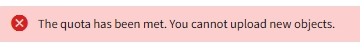

= Mandantenmanager-Dashboard verstehen
:allow-uri-read: 
:icons: font
:imagesdir: ../media/

[role="lead"]
Das Tenant Manager-Dashboard bietet einen Überblick über die Konfiguration eines Mandantenkontos und die Menge an Speicherplatz, die von Objekten in den Buckets (S3) oder Containern (Swift) verwendet wird. Wenn der Mandant über ein Kontingent verfügt, wird im Dashboard angezeigt, wie viel des Kontingents verwendet wird und wie viel übrig bleibt. Wenn Fehler im Zusammenhang mit dem Mandantenkonto auftreten, werden die Fehler auf dem Dashboard angezeigt.

NOTE: Die Werte für den genutzten Speicherplatz sind Schätzungen. Diese Schätzungen sind vom Zeitpunkt der Aufnahme, der Netzwerkverbindung und des Node-Status betroffen.

Wenn Objekte hochgeladen wurden, sieht das Dashboard wie das folgende Beispiel aus:

image::../media/tenant_dashboard_with_buckets.png[Dashboard – Bucket-Liste]

== Zusammenfassung des Mandantenkontos

Oben im Dashboard sind die folgenden Informationen enthalten:

* Die Anzahl der konfigurierten Buckets oder Container, Gruppen und Benutzer
* Die Anzahl der Endpunkte von Plattformservices, falls vorhanden

Sie können die Links auswählen, um die Details anzuzeigen.

Auf der rechten Seite des Dashboards sind folgende Informationen enthalten:

* Die Gesamtzahl der Objekte für den Mandanten.
+
Wenn für ein S3-Konto keine Objekte aufgenommen wurden und Sie über den verfügen link:tenant-management-permissions.html["Root-Zugriffsberechtigung"], Erste Startrichtlinien werden anstelle der Gesamtanzahl der Objekte angezeigt.

* Mandantendetails, einschließlich des Mandantenkontonnamens und der ID und der Frage, ob der Mandant verwendet werden kann link:what-platform-services-are.html["Plattform-Services"], link:../admin/using-identity-federation.html["Seine eigene Identitätsquelle"], link:grid-federation-account-clone.html["Grid-Verbund"], Oder  link:../admin/manage-s3-select-for-tenant-accounts.html["S3 Select"] (Es werden nur die aktivierten Berechtigungen aufgelistet.)

== Storage- und Kontingentnutzung

Das Fenster Speichernutzung enthält die folgenden Informationen:

* Die Menge der Objektdaten für den Mandanten.
+

TIP: Dieser Wert gibt die Gesamtanzahl der hochgeladenen Objektdaten an und stellt nicht den Speicherplatz dar, der zum Speichern der Kopien dieser Objekte und ihrer Metadaten verwendet wird.

* Wenn ein Kontingent festgelegt ist, ist die Gesamtmenge an Speicherplatz, der für Objektdaten verfügbar ist, sowie die Menge und der Prozentsatz des verbleibenden Speicherplatzes. Der Kontingentnutzer beschränkt die Menge der Objektdaten, die aufgenommen werden können.
+

CAUTION: Die Quotennutzung basiert auf internen Schätzungen und kann in einigen Fällen überschritten werden. StorageGRID überprüft beispielsweise das Kontingent, wenn ein Mandant beginnt, Objekte hochzuladen und neue Einlässe zurückweist, wenn der Mieter die Quote überschritten hat. StorageGRID berücksichtigt jedoch bei der Bestimmung, ob das Kontingent überschritten wurde, nicht die Größe des aktuellen Uploads. Wenn Objekte gelöscht werden, kann ein Mandant vorübergehend daran gehindert werden, neue Objekte hochzuladen, bis die Kontingentnutzung neu berechnet wird. Berechnungen der Kontingentnutzung können 10 Minuten oder länger dauern.

* Ein Balkendiagramm, das die relative Größe der größten Buckets oder Container darstellt.
+
Sie können den Mauszeiger über eines der Diagrammsegmente platzieren, um den gesamten Speicherplatz anzuzeigen, der von diesem Bucket oder Container verbraucht wird.

+
image::../media/tenant_dashboard_storage_usage_segment.png[Balkendiagramm Segment]

* Zur Übereinstimmung mit dem Balkendiagramm, eine Liste der größten Buckets oder Container, einschließlich der Gesamtzahl der Objektdaten und der Anzahl der Objekte für jeden Bucket oder Container.
+
image::../media/tenant_dashboard_buckets.png[Mandanten-Dashboard-Buckets]

+
Wenn ein Mandant mehr als neun Buckets oder Container enthält, werden alle anderen Buckets oder Container zu einem Eintrag im unteren Teil der Liste zusammengefasst.

NOTE: Um die Einheiten für die im Tenant Manager angezeigten Speicherwerte zu ändern, wählen Sie oben rechts im Tenant Manager das Benutzer-Dropdown aus, und wählen Sie dann *Benutzereinstellungen* aus.

== Warnmeldungen zur Kontingentnutzung

Wenn im Grid Manager Warnmeldungen zur Kontingentnutzung aktiviert wurden, werden diese im Mandanten-Manager angezeigt, wenn das Kontingent niedrig oder überschritten ist, wie folgt:

Wenn 90% oder mehr der Quote eines Mandanten verwendet wurden, wird die Meldung *Tenant Quotenverbrauch hoch* ausgelöst. Führen Sie die empfohlenen Aktionen für die Warnmeldung aus.

image::../media/tenant_dashboard_quota_remaining.png[Verbleibendes Mandanten-Dashboard-Kontingent]

Wenn Sie Ihre Quote überschreiten, können Sie keine neuen Objekte hochladen.

== Endpunktfehler

Wenn Sie mit Grid Manager einen oder mehrere Endpunkte für die Verwendung mit Plattformdiensten konfiguriert haben, zeigt das Tenant Manager-Dashboard eine Warnmeldung an, wenn in den letzten sieben Tagen Endpunktfehler aufgetreten sind.

image::../media/tenant_dashboard_endpoint_error.png[Dashboard mit Endpunkt-Meldung]

Um Details über anzuzeigen link:troubleshooting-platform-services-endpoint-errors.html["Fehler am Endpunkt der Plattformdienste"]Wählen Sie *Endpoints*, um die Seite Endpoints anzuzeigen.
