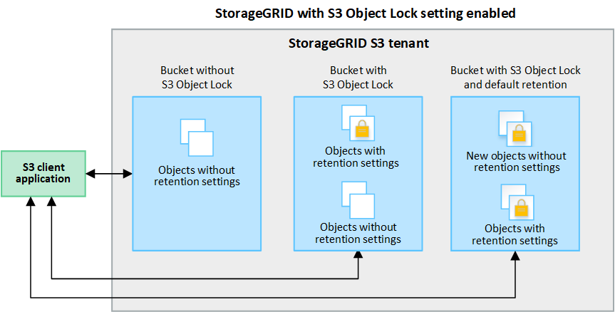

= Verwenden Sie S3 Objektsperre, um Objekte beizubehalten
:allow-uri-read: 
:icons: font
:imagesdir: ../media/

[role="lead"]
Sie können S3 Object Lock verwenden, wenn Buckets und Objekte die gesetzlichen Aufbewahrungsanforderungen erfüllen müssen.

== Was ist S3 Object Lock?

Die Funktion StorageGRID S3 Object Lock ist eine Objektschutzlösung, die der S3 Object Lock in Amazon Simple Storage Service (Amazon S3) entspricht.

Wenn die globale S3-Objektsperre für ein StorageGRID-System aktiviert ist, kann ein S3-Mandantenkonto Buckets mit oder ohne aktivierte S3-Objektsperre erstellen. Wenn für einen Bucket die S3 Object Lock aktiviert ist, ist die Bucket-Versionierung erforderlich und wird automatisch aktiviert.

Wenn für einen Bucket die S3 Object Lock aktiviert ist, können S3-Client-Applikationen optional Aufbewahrungseinstellungen für jede Objektversion angeben, die in diesem Bucket gespeichert ist.

Darüber hinaus kann für einen Bucket, auf dem die S3 Object Lock aktiviert ist, optional ein Standardaufbewahrungsmodus und ein Aufbewahrungszeitraum verwendet werden. Die Standardeinstellungen gelten nur für Objekte, die ohne eigene Aufbewahrungseinstellungen zum Bucket hinzugefügt werden.

=== Aufbewahrungsmodi

Die Objektsperrfunktion StorageGRID S3 unterstützt zwei Aufbewahrungsmodi, um verschiedene Schutzstufen auf Objekte anzuwenden. Diese Modi entsprechen den Amazon S3 Aufbewahrungsmodi.

* Im Compliance-Modus:
+
** Das Objekt kann erst gelöscht werden, wenn das Aufbewahrungsdatum erreicht ist.
** Das Aufbewahrungsdatum des Objekts kann erhöht, aber nicht verringert werden.
** Das Aufbewahrungsdatum des Objekts kann erst entfernt werden, wenn dieses Datum erreicht ist.

* Im Governance-Modus:
+
** Benutzer mit besonderer Berechtigung können in Anfragen einen Überbrückungskopf verwenden, um bestimmte Aufbewahrungseinstellungen zu ändern.
** Diese Benutzer können eine Objektversion löschen, bevor das Aufbewahrungsdatum erreicht ist.
** Diese Benutzer können das Aufbewahrungsdatum eines Objekts erhöhen, verringern oder entfernen.

=== Aufbewahrungseinstellungen für Objektversionen

Wenn ein Bucket mit aktivierter S3-Objektsperrung erstellt wird, können Benutzer mithilfe der S3-Client-Applikation optional die folgenden Aufbewahrungseinstellungen für jedes Objekt angeben, das dem Bucket hinzugefügt wird:

* *Retention Mode*: Entweder Compliance oder Governance.
* *Rebeat-until-date*: Wenn das Aufbewahrungsdatum einer Objektversion in der Zukunft liegt, kann das Objekt abgerufen, aber nicht gelöscht werden.
* *Legal Hold*: Die Anwendung eines gesetzlichen Hold auf eine Objektversion sperrt diesen Gegenstand sofort. Beispielsweise müssen Sie ein Objekt, das mit einer Untersuchung oder einem Rechtsstreit zusammenhängt, rechtlich festhalten. Eine gesetzliche Aufbewahrungspflichten haben kein Ablaufdatum, bleiben aber bis zur ausdrücklichen Entfernung erhalten. Die gesetzlichen Aufbewahrungspflichten sind unabhängig von der bisherigen Aufbewahrungsfrist.
+

NOTE: Befindet sich ein Objekt unter einer Legal Hold-Funktion, kann das Objekt unabhängig vom Aufbewahrungsmodus nicht gelöscht werden.

+
Weitere Informationen zu den Objekteinstellungen finden Sie unter link:../s3/use-s3-api-for-s3-object-lock.html["Konfigurieren Sie die S3-Objektsperre über die S3-REST-API"].

=== Standardeinstellung für die Aufbewahrung von Buckets

Wenn ein Bucket mit aktivierter S3-Objektsperrung erstellt wurde, können Benutzer optional die folgenden Standardeinstellungen für den Bucket angeben:

* *Default Retention Mode*: Entweder Compliance oder Governance.
* *Default Retention Period*: Wie lange neue Objektversionen, die zu diesem Bucket hinzugefügt wurden, beibehalten werden sollen, beginnend mit dem Tag, an dem sie hinzugefügt werden.

Die Standard-Bucket-Einstellungen gelten nur für neue Objekte, die keine eigenen Aufbewahrungseinstellungen haben. Vorhandene Bucket-Objekte werden nicht beeinflusst, wenn Sie diese Standardeinstellungen hinzufügen oder ändern.

Siehe link:../tenant/creating-s3-bucket.html["Erstellen eines S3-Buckets"] Und link:../tenant/update-default-retention-settings.html["Aktualisieren Sie die S3 Object Lock-Standardaufbewahrung"].

== S3-Objektsperre-Workflow

Das Workflow-Diagramm zeigt die grundlegenden Schritte zur Verwendung der S3-Objektsperre in StorageGRID.

Bevor Sie Buckets mit aktivierter S3-Objektsperre erstellen können, muss der Grid-Administrator die globale S3-Objektsperreneinstellung für das gesamte StorageGRID-System aktivieren. Der Grid-Administrator muss außerdem sicherstellen, dass die Richtlinie für Information Lifecycle Management (ILM) „konform“ ist; er muss die Anforderungen von Buckets erfüllen, für die S3 Object Lock aktiviert ist. Weitere Informationen erhalten Sie von Ihrem Grid-Administrator oder in den Anweisungen für link:../ilm/managing-objects-with-s3-object-lock.html["Managen von Objekten mit S3 Object Lock"].

Nachdem die globale S3 Object Lock-Einstellung aktiviert wurde, können Sie Buckets erstellen, für die S3 Object Lock aktiviert ist, und optional für jeden Bucket Standardaufbewahrungseinstellungen festlegen. Darüber hinaus können Sie mit der S3-Client-Anwendung optional Aufbewahrungseinstellungen für jede Objektversion angeben.

image::../media/s3_object_lock_workflow_tenant.png[S3-Objekt-Lock-Workflow-Mandant]

== Anforderungen für Buckets, bei denen die S3-Objektsperre aktiviert ist

* Wenn die globale S3-Objektsperre für das StorageGRID System aktiviert ist, können Sie die Buckets mit aktivierter S3-Objektsperre über den Mandantenmanager, die Mandantenmanagement-API oder die S3-REST-API erstellen.
* Wenn Sie die S3-Objektsperre verwenden möchten, müssen Sie beim Erstellen des Buckets die S3-Objektsperre aktivieren. Sie können die S3-Objektsperre für einen vorhandenen Bucket nicht aktivieren.
* Wenn die S3-Objektsperre für einen Bucket aktiviert ist, ermöglicht StorageGRID automatisch die Versionierung für diesen Bucket. Sie können S3 Object Lock nicht deaktivieren oder die Versionierung für den Bucket nicht unterbrechen.
* Optional können Sie mithilfe von Tenant Manager, der Mandanten-Management-API oder der S3-REST-API für jeden Bucket einen Standardaufbewahrungsmodus und einen Aufbewahrungszeitraum angeben. Die Standardaufbewahrungseinstellungen des Buckets gelten nur für neue Objekte, die dem Bucket hinzugefügt wurden und keine eigenen Aufbewahrungseinstellungen haben. Sie können diese Standardeinstellungen außer Kraft setzen, indem Sie einen Aufbewahrungsmodus und das Aufbewahrungsdatum für jede Objektversion festlegen, wenn sie hochgeladen wird.
* Die Konfiguration des Bucket-Lebenszyklus wird für Buckets unterstützt, für die S3 Object Lock aktiviert ist.
* Die CloudMirror-Replizierung wird für Buckets nicht unterstützt, wenn S3-Objektsperre aktiviert ist.

== Anforderungen für Objekte in Buckets, bei denen die S3-Objektsperre aktiviert ist

* Zum Schutz einer Objektversion können Sie Standardaufbewahrungseinstellungen für den Bucket angeben oder Aufbewahrungseinstellungen für jede Objektversion angeben. Aufbewahrungseinstellungen auf Objektebene können mit der S3-Client-Applikation oder der S3-REST-API angegeben werden.
* Aufbewahrungseinstellungen gelten für einzelne Objektversionen. Eine Objektversion kann sowohl eine Aufbewahrungsfrist als auch eine gesetzliche Haltungseinstellung haben, eine jedoch nicht die andere oder keine. Wenn Sie eine Aufbewahrungsfrist oder eine gesetzliche Aufbewahrungseinstellung für ein Objekt angeben, wird nur die in der Anforderung angegebene Version geschützt. Sie können neue Versionen des Objekts erstellen, während die vorherige Version des Objekts gesperrt bleibt.

== Lebenszyklus von Objekten in Buckets, wobei S3 Objektsperre aktiviert ist

Jedes in einem Bucket gespeicherte Objekt mit aktivierter S3 Object Lock durchlaufen die folgenden Phasen:

. *Objektaufnahme*
+
Wenn einem Bucket eine Objektversion hinzugefügt wird, für die S3 Object Lock aktiviert ist, werden die Aufbewahrungseinstellungen wie folgt angewendet:

+
** Wenn für das Objekt Aufbewahrungseinstellungen angegeben werden, werden die Einstellungen auf Objektebene angewendet. Alle standardmäßigen Bucket-Einstellungen werden ignoriert.
** Wenn für das Objekt keine Aufbewahrungseinstellungen angegeben sind, werden die Standard-Bucket-Einstellungen angewendet, sofern diese vorhanden sind.
** Wenn für das Objekt oder den Bucket keine Aufbewahrungseinstellungen angegeben wurden, ist das Objekt nicht durch S3 Object Lock geschützt.

+
Wenn Aufbewahrungseinstellungen angewendet werden, sind sowohl das Objekt als auch alle benutzerdefinierten S3-Metadaten geschützt.

. *Objektaufbewahrung und -Löschung*
+
Von jedem geschützten Objekt werden innerhalb StorageGRID des angegebenen Aufbewahrungszeitraums mehrere Kopien gespeichert. Die genaue Anzahl und Art der Objektkopien sowie der Speicherort werden durch konforme Regeln in den aktiven ILM-Richtlinien bestimmt. Ob ein geschütztes Objekt gelöscht werden kann, bevor das Aufbewahrungsdatum erreicht ist, hängt vom Aufbewahrungsmodus ab.

+
** Befindet sich ein Objekt unter einer Legal Hold-Funktion, kann das Objekt unabhängig vom Aufbewahrungsmodus nicht gelöscht werden.

== Kann ich auch ältere konforme Buckets verwalten?

Die S3-Objektsperre ersetzt die in früheren StorageGRID-Versionen verfügbare Compliance-Funktion. Wenn Sie mithilfe einer früheren Version von StorageGRID konforme Buckets erstellt haben, können Sie die Einstellungen dieser Buckets weiterhin verwalten. Sie können jedoch keine neuen, konformen Buckets mehr erstellen. Anweisungen hierzu finden Sie unter
https://kb.netapp.com/Advice_and_Troubleshooting/Hybrid_Cloud_Infrastructure/StorageGRID/How_to_manage_legacy_Compliant_buckets_in_StorageGRID_11.5["NetApp Knowledge Base: Management älterer, konformer Buckets für StorageGRID 11.5"^].
