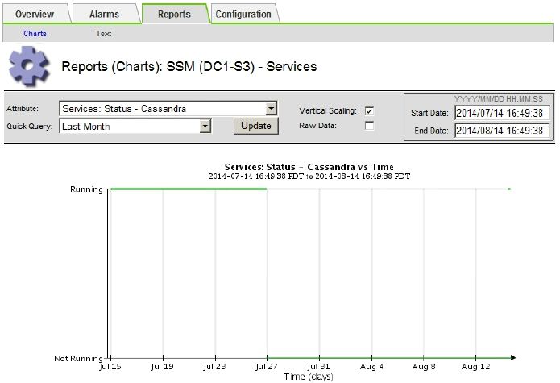

= Behebung von Metadatenproblemen
:allow-uri-read: 
:icons: font
:imagesdir: ../media/

[role="lead"]
Sie können mehrere Aufgaben durchführen, um die Ursache von Metadatenproblemen zu ermitteln.

== Warnmeldung für Storage mit niedrigen Metadaten

Wenn die Warnung * Storage* mit niedrigen Metadaten ausgelöst wird, müssen Sie neue Storage-Nodes hinzufügen.

.Bevor Sie beginnen
* Sie sind mit einem bei Grid Manager angemeldet link:../admin/web-browser-requirements.html["Unterstützter Webbrowser"].

.Über diese Aufgabe
StorageGRID reserviert eine bestimmte Menge an Speicherplatz auf Volume 0 jedes Storage-Nodes für Objekt-Metadaten. Dieser Speicherplatz wird als tatsächlicher reservierter Speicherplatz bezeichnet und in den Speicherplatz für Objekt-Metadaten (zulässiger Metadatenspeicherplatz) und den für wichtige Datenbankvorgänge wie Data-Compaction und Reparatur erforderlichen Speicherplatz unterteilt. Der zulässige Metadatenspeicherplatz bestimmt die gesamte Objektkapazität.

image::../media/metadata_allowed_space_volume_0.png[Metadaten Zulässig Speicherplatz Volume 0]

Wenn Objektmetadaten mehr als 100 % des für Metadaten zulässigen Speicherplatzes verbrauchen, können Datenbankvorgänge nicht effizient ausgeführt werden und es treten Fehler auf.

Das können Sie link:../monitor/monitoring-storage-capacity.html#monitor-object-metadata-capacity-for-each-storage-node["Überwachen der Objekt-Metadaten-Kapazität für jeden Storage Node"] Um Ihnen zu helfen, Fehler frühzeitig zu erkennen und zu beheben, bevor sie auftreten.

StorageGRID verwendet die folgende Prometheus Kennzahl, um den vollen Umfang des zulässigen Metadaten-Speicherplatzes zu messen:

[listing]
----
storagegrid_storage_utilization_metadata_bytes/storagegrid_storage_utilization_metadata_allowed_bytes
----
Wenn dieser Prometheus-Ausdruck bestimmte Schwellenwerte erreicht, wird die Warnung *Low Metadaten Storage* ausgelöst.

* *Minor*: Objektmetadaten verwenden 70% oder mehr des zulässigen Metadaten-Speicherplatzes. Sie sollten so bald wie möglich neue Storage-Nodes hinzufügen.
* *Major*: Objektmetadaten verwenden 90% oder mehr des zulässigen Metadaten-Speicherplatzes. Sie müssen sofort neue Storage-Nodes hinzufügen.
+

CAUTION: Wenn Objektmetadaten 90 % oder mehr des zulässigen Metadatenspeichers verwenden, wird eine Warnung im Dashboard angezeigt. Wenn diese Warnung angezeigt wird, müssen Sie sofort neue Speicherknoten hinzufügen. Es ist nicht zulässig, dass Objektmetadaten mehr als 100 % des zulässigen Speicherplatzes nutzen.

* *Kritisch*: Objektmetadaten verbrauchen 100% oder mehr des zulässigen Metadaten-Speicherplatzes und verbrauchen den für wichtige Datenbankvorgänge erforderlichen Speicherplatz. Sie müssen die Aufnahme neuer Objekte beenden und sofort neue Speicherknoten hinzufügen.

In dem folgenden Beispiel belegen die Objektmetadaten mehr als 100 % des zulässigen Metadaten-Speicherplatzes. Hierbei handelt es sich um eine kritische Situation, die zu einem ineffizienten und ineffizienten Datenbankbetrieb und zu Fehlern führt.

image::../media/cdlp_dashboard_alarm.gif[Metadatenkonsole – Alarm]

CAUTION: Wenn die Größe von Volume 0 kleiner ist als die Option „Metadatenreservierter Speicherplatz“ (z. B. in einer nicht-Produktionsumgebung), kann die Berechnung für die Warnmeldung * Low Metadaten Storage* fehlerhaft sein.

.Schritte
. Wählen Sie *ALERTS* > *Current*.
. Erweitern Sie, falls erforderlich, aus der Warnmeldungstabelle die Warnungsgruppe *Low-Metadaten-Speicher* und wählen Sie die spezifische Warnung aus, die Sie anzeigen möchten.
. Überprüfen Sie die Details im Dialogfeld „Warnung“.
. Wenn eine wichtige oder kritische Warnung für * Storage-Systeme mit niedrigen Metadaten* ausgelöst wurde, führen Sie eine Erweiterung durch, um Storage-Nodes sofort hinzuzufügen.
+

NOTE: Da StorageGRID komplette Kopien aller Objektmetadaten an jedem Standort speichert, wird die Metadaten-Kapazität des gesamten Grid durch die Metadaten-Kapazität des kleinsten Standorts begrenzt. Wenn Sie Metadaten an einem Standort hinzufügen müssen, sollten Sie auch link:../expand/adding-grid-nodes-to-existing-site-or-adding-new-site.html["Erweitern Sie alle anderen Standorte"] An die gleiche Anzahl von Storage-Nodes.

+
Nach der Erweiterung verteilt StorageGRID die vorhandenen Objekt-Metadaten neu auf die neuen Nodes, wodurch die allgemeine Metadaten des Grid erhöht werden. Es ist keine Benutzeraktion erforderlich. Die Warnung * Speicherung von niedrigen Metadaten* wird gelöscht.

== Leistungen: Status - Cassandra (SVST) Alarm

Der Alarm Services: Status – Cassandra (SVST) gibt an, dass Sie die Cassandra-Datenbank für einen Storage-Node möglicherweise neu aufbauen müssen. Cassandra dient als Metadatenspeicher für StorageGRID.

.Bevor Sie beginnen
* Sie müssen mit einem beim Grid Manager angemeldet sein link:../admin/web-browser-requirements.html["Unterstützter Webbrowser"].
* Das ist schon link:../admin/admin-group-permissions.html["Bestimmte Zugriffsberechtigungen"].
* Sie müssen die haben `Passwords.txt` Datei:

.Über diese Aufgabe
Wenn Cassandra länger als 15 Tage angehalten wird (z. B. ausgeschaltet), startet Cassandra nicht, wenn der Node wieder online geschaltet wird. Sie müssen die Cassandra-Datenbank für den betroffenen DDS-Dienst neu erstellen.

Das können Sie link:../monitor/running-diagnostics.html["Führen Sie eine Diagnose aus"] Um zusätzliche Informationen über den aktuellen Zustand des Rasters zu erhalten.

CAUTION: Wenn zwei oder mehr der Cassandra-Datenbankdienste länger als 15 Tage ausgefallen sind, wenden Sie sich an den technischen Support und fahren Sie nicht mit den unten aufgeführten Schritten fort.

.Schritte
. Wählen Sie *SUPPORT* > *Tools* > *Grid-Topologie* aus.
. Wählen Sie *_Site_* > *_Storage Node_* > *SSM* > *Services* > *Alarme* > *Main*, um Alarme anzuzeigen.
+
Dieses Beispiel zeigt, dass der SVST-Alarm ausgelöst wurde.

+
image::../media/svst_alarm.gif[Alarme: SSM: Dienste Seite]

+
Auf der SSM Services-Hauptseite wird auch angezeigt, dass Cassandra nicht ausgeführt wird.

+
image::../media/cassandra_not_running.gif[Übersicht: SSM: Services Seite]

. [[restart_Cassandra_from_the_Storage_Node]]Versuchen Sie, Cassandra vom Speicher-Node neu zu starten:
+
.. Melden Sie sich beim Grid-Node an:
+
... Geben Sie den folgenden Befehl ein: `ssh admin@grid_node_IP`
... Geben Sie das im aufgeführte Passwort ein `Passwords.txt` Datei:
... Geben Sie den folgenden Befehl ein, um zum Root zu wechseln: `su -`
... Geben Sie das im aufgeführte Passwort ein `Passwords.txt` Datei:
Wenn Sie als root angemeldet sind, ändert sich die Eingabeaufforderung von `$` Bis `#`.

.. Geben Sie Ein: `/etc/init.d/cassandra status`
.. Falls Cassandra nicht ausgeführt wird, starten Sie es neu: `/etc/init.d/cassandra restart`

. Falls Cassandra nicht neu startet, bestimmen Sie, wie lange Cassandra ausgefallen ist. Wenn Cassandra länger als 15 Tage ausfällt, müssen Sie die Cassandra-Datenbank neu aufbauen.
+

CAUTION: Wenn zwei oder mehr der Cassandra-Datenbankdienste ausgefallen sind, wenden Sie sich an den technischen Support, und fahren Sie nicht mit den folgenden Schritten fort.

+
Sie können feststellen, wie lange Cassandra ausgefallen ist, indem Sie sie aufschreiben oder die Datei servermanager.log lesen.

. Cassandra Diagramm:
+
.. Wählen Sie *SUPPORT* > *Tools* > *Grid-Topologie* aus. Wählen Sie dann *_Site_* > *_Storage Node_* > *SSM* > *Services* > *Berichte* > *Diagramme* aus.
.. Wählen Sie *Attribut* > *Service: Status - Cassandra*.
.. Geben Sie für *Startdatum* ein Datum ein, das mindestens 16 Tage vor dem aktuellen Datum liegt. Geben Sie für *Enddatum* das aktuelle Datum ein.
.. Klicken Sie Auf *Aktualisieren*.
.. Wenn Cassandra für mehr als 15 Tage nicht verfügbar ist, bauen Sie die Cassandra-Datenbank erneut aus.
+
Das folgende Diagramm zeigt, dass Cassandra seit mindestens 17 Tagen ausgefallen ist.

+

. So prüfen Sie die Datei servermanager.log auf dem Speicherknoten:
+
.. Melden Sie sich beim Grid-Node an:
+
... Geben Sie den folgenden Befehl ein: `ssh admin@grid_node_IP`
... Geben Sie das im aufgeführte Passwort ein `Passwords.txt` Datei:
... Geben Sie den folgenden Befehl ein, um zum Root zu wechseln: `su -`
... Geben Sie das im aufgeführte Passwort ein `Passwords.txt` Datei:
Wenn Sie als root angemeldet sind, ändert sich die Eingabeaufforderung von `$` Bis `#`.

.. Geben Sie Ein: `cat /var/local/log/servermanager.log`
+
Der Inhalt der Datei servermanager.log wird angezeigt.

+
Wenn Cassandra länger als 15 Tage ausfällt, wird die folgende Meldung in der Datei servermanager.log angezeigt:

+
[listing]
----
"2014-08-14 21:01:35 +0000 | cassandra | cassandra not
started because it has been offline for longer than
its 15 day grace period - rebuild cassandra
----
.. Stellen Sie sicher, dass der Zeitstempel dieser Nachricht der Zeitpunkt ist, zu dem Sie versucht haben, Cassandra wie in Schritt angegeben neu zu starten <<restart_Cassandra_from_the_Storage_Node,Starten Sie Cassandra vom Storage-Node aus neu>>.
+
Für Cassandra gibt es mehrere Einträge; Sie müssen den letzten Eintrag finden.

.. Wenn Cassandra länger als 15 Tage ausfällt, müssen Sie die Cassandra-Datenbank neu aufbauen.
+
Anweisungen hierzu finden Sie unter link:../maintain/recovering-storage-node-that-has-been-down-more-than-15-days.html["Stellen Sie Storage Node länger als 15 Tage wieder her"].

.. Wenden Sie sich an den technischen Support, wenn die Alarme nach der Neuerstellung von Cassandra nicht gelöscht werden.

== Cassandra-Fehler bei nicht genügend Speicher (SMTT-Alarm)

Ein Alarm für Total Events (SMTT) wird ausgelöst, wenn die Cassandra-Datenbank einen Fehler außerhalb des Arbeitsspeichers hat. Wenn dieser Fehler auftritt, wenden Sie sich an den technischen Support, um das Problem zu bearbeiten.

.Über diese Aufgabe
Wenn für die Cassandra-Datenbank ein Fehler außerhalb des Arbeitsspeichers auftritt, wird ein Heap Dump erstellt, ein SMTT-Alarm (Total Events) ausgelöst und die Anzahl der Cassandra Heap Out of Memory-Fehler wird um eins erhöht.

.Schritte
. Sehen Sie sich die Veranstaltung an:
+
.. Wählen Sie *SUPPORT* > *Tools* > *Grid-Topologie* aus.
.. Erweitern Sie die Site und wählen Sie dann *_grid_node_* aus.
.. Wählen Sie *SSM* und dann *Ereignisse* > *Konfiguration*.

. Stellen Sie sicher, dass die Anzahl der Cassandra Heap-Fehler bei einem Speicherfehler mindestens 1 beträgt.
+
Das können Sie link:../monitor/running-diagnostics.html["Führen Sie eine Diagnose aus"] Um zusätzliche Informationen über den aktuellen Zustand des Rasters zu erhalten.

. Melden Sie sich per SSH als „admin“ beim ausgewählten Knoten an und wechseln Sie zum lokalen Root-Benutzer.
. Gehen Sie zu `/var/local/core/`, Komprimieren Sie die `Cassandra.hprof` Datei erstellen und an den technischen Support senden.
. Erstellen Sie ein Backup der `Cassandra.hprof` Datei und löschen Sie sie aus dem `/var/local/core/ directory`.
+
Diese Datei kann bis zu 24 GB groß sein, so sollten Sie sie entfernen, um Speicherplatz freizugeben.

. Nachdem das Problem behoben wurde, aktivieren Sie das Kontrollkästchen *Reset* für die Anzahl der Cassandra Heap Out of Memory-Fehler. Wählen Sie dann *Änderungen anwenden*.
+

NOTE: Um die Anzahl der Ereignisse zurückzusetzen, müssen Sie über die Berechtigung zur Konfiguration der Grid-Topologie-Seite verfügen.

